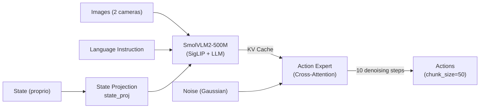
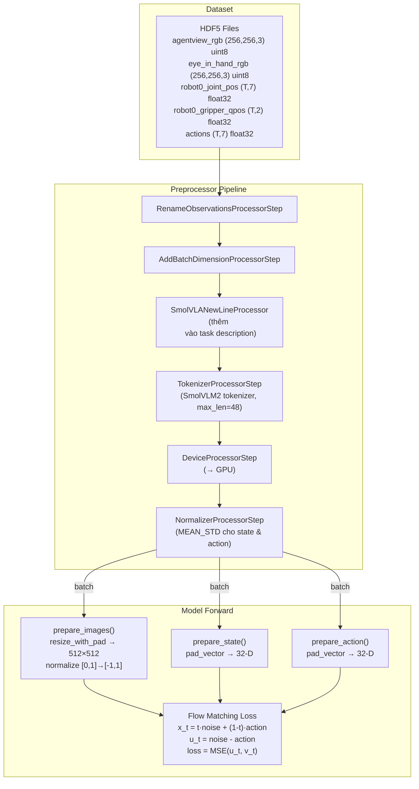

# Phân Tích Chi Tiết: SmolVLA 500M + LIBERO trong LeRobot

## 1. Tổng Quan Kiến Trúc SmolVLA

SmolVLA là mô hình VLA (Vision-Language-Action) nhẹ sử dụng **Flow Matching** để sinh action. Kiến trúc gồm 2 phần chính:



### Thông số chính từ [configuration_smolvla.py](file:///home/ubuntu/Project/pact/src/lerobot/policies/smolvla/configuration_smolvla.py)

| Tham số | Giá trị | Ý nghĩa |
|---------|---------|---------|
| `vlm_model_name` | `SmolVLM2-500M-Video-Instruct` | VLM backbone |
| `chunk_size` | 50 | Số action steps trong mỗi chunk |
| `n_action_steps` | 50 | Số action thực thi mỗi lần predict |
| `num_steps` | 10 | Số bước denoising (Euler integration) |
| `max_state_dim` | 32 | State được pad tới 32-D |
| `max_action_dim` | 32 | Action được pad tới 32-D |
| `resize_imgs_with_padding` | (512, 512) | Resize ảnh + pad giữ tỉ lệ |
| `freeze_vision_encoder` | True | Đóng băng SigLIP vision encoder |
| `train_expert_only` | True | Chỉ train Action Expert |
| `num_vlm_layers` | 16 | Số layers VLM sử dụng |
| `expert_width_multiplier` | 0.75 | Expert hidden size = 0.75 × VLM |

---

## 2. So Sánh Normalization: LeRobot vs. Cấu Hình LIBERO Tùy Chỉnh

> [!IMPORTANT]
> Đây là phần **quan trọng nhất** — sự khác biệt giữa normalization mặc định của LeRobot và cấu hình bạn đề xuất trong [docs/libero.md](file:///home/ubuntu/Project/pact/docs/libero.md).

### 2.1 LeRobot Mặc Định (SmolVLAConfig)

Từ [configuration_smolvla.py:35-41](file:///home/ubuntu/Project/pact/src/lerobot/policies/smolvla/configuration_smolvla.py#L35-L41):

```python
normalization_mapping = {
    "VISUAL": NormalizationMode.IDENTITY,    # Không normalize ảnh (raw [0,1])
    "STATE": NormalizationMode.MEAN_STD,     # Z-score cho state
    "ACTION": NormalizationMode.MEAN_STD,    # Z-score cho action
}
```

**LeRobot sử dụng MEAN_STD (Z-score) cho TOÀN BỘ state và action vector**, không phân biệt từng dimension.

Cụ thể trong [normalize_processor.py:325-338](file:///home/ubuntu/Project/pact/src/lerobot/processor/normalize_processor.py#L325-L338):
```python
if norm_mode == NormalizationMode.MEAN_STD:
    mean, std = stats["mean"], stats["std"]
    denom = std + eps  # eps = 1e-8
    return (tensor - mean) / denom    # normalize
    # return tensor * std + mean      # unnormalize
```

### 2.2 Cấu Hình Tùy Chỉnh Trong [docs/libero.md](file:///home/ubuntu/Project/pact/docs/libero.md)

Từ [libero.md](file:///home/ubuntu/Project/pact/docs/libero.md):

| Thành phần | LeRobot mặc định | Cấu hình tùy chỉnh (libero.md) |
|------------|-------------------|-------------------------------|
| **Action dims 0-5** (Δpose) | MEAN_STD (tất cả 7 dim) | Z-score chỉ cho 6 dim đầu |
| **Action dim 6** (gripper) | MEAN_STD (normalize cùng) | **Passthrough {-1, +1}** — không normalize |
| **Proprio dims 0-6** (joint) | MEAN_STD (tất cả 9 dim) | Z-score riêng cho joints |
| **Proprio dims 7-8** (finger) | MEAN_STD (cùng vector) | **Min-Max → [-1, 1]** riêng cho fingers |
| **Images** | IDENTITY (đã normalize [-1,1] bên trong model) | CLIP mean/std normalize |

### 2.3 Phân Tích Chi Tiết Các Khác Biệt

#### ❶ Gripper Action (dim 6): Passthrough vs MEAN_STD

**Cấu hình tùy chỉnh:**
```python
# dim 6: gripper {-1, +1} → passthrough, KHÔNG normalize
a_norm[6] = action[6]  # giữ nguyên raw binary
```

**LeRobot mặc định:** Normalize toàn bộ 7-D action bằng MEAN_STD, bao gồm cả gripper.

> [!WARNING]
> **Vấn đề:** Gripper là giá trị binary {-1, +1}. Nếu áp dụng Z-score, mean ≈ 0 (nếu open/close cân bằng) và std rất nhỏ, dẫn đến giá trị normalized rất lớn (+10, -10). Khi model predict và unnormalize, lỗi nhỏ sẽ bị phóng đại gây sai gripper state.
>
> **Tuy nhiên:** LeRobot's MEAN_STD normalize **cùng vector** — mean và std được tính per-dimension, nên gripper dim 6 sẽ có mean/std riêng. Giá trị binary {-1,+1} với mean≈0, std≈1 sẽ cho normalized ≈ {-1, +1} — tương đối ổn nếu data cân bằng.

#### ❷ Proprio: Hybrid Z-score + Min-Max vs Uniform MEAN_STD

**Cấu hình tùy chỉnh:**
```python
# joints (7-D): Z-score
j = (joint_pos - joint_mean) / (joint_std + 1e-6)
# fingers (2-D): Min-Max → [-1, 1]  
g = 2.0 * (gripper_qpos - f_min) / (f_max - f_min + 1e-6) - 1.0
g = np.clip(g, -1.0, 1.0)
proprio = concatenate([j, g])  # (9,)
```

**LeRobot mặc định:** MEAN_STD cho toàn bộ 9-D state vector.

> [!NOTE]
> LeRobot tính mean/std **per-dimension** cho state. Finger dims (thường nhỏ, dải hẹp) sẽ có std rất nhỏ → giá trị normalized lớn. Cấu hình tùy chỉnh sử dụng Min-Max bounded [-1,1] cho fingers → ổn định hơn.

#### ❸ Image Preprocessing

**LeRobot SmolVLA** (trong [modeling_smolvla.py:404-444](file:///home/ubuntu/Project/pact/src/lerobot/policies/smolvla/modeling_smolvla.py#L404-L444)):
```python
# 1. Resize 256×256 → 512×512 (with padding, keep aspect ratio)
img = resize_with_pad(img, 512, 512, pad_value=0)
# 2. Normalize [0,1] → [-1,1] cho SigLIP
img = img * 2.0 - 1.0
```

**Cấu hình tùy chỉnh (libero.md):**
```yaml
target_size: [224, 224]
normalize: clip   # ÷255 → CLIP mean/std
clip_mean: [0.48145466, 0.4578275, 0.40821073]
clip_std:  [0.26862954, 0.26130258, 0.27577711]
```

> [!CAUTION]
> **Khác biệt lớn!** SmolVLA sử dụng SigLIP (không phải CLIP) nên cần range [-1,1], không cần CLIP mean/std. Cấu hình tùy chỉnh dành cho model khác (dùng CLIP encoder). **Khi train SmolVLA, bạn PHẢI dùng preprocessing mặc định của SmolVLA** (resize 512×512 + [-1,1]).

---

## 3. Pipeline Training Chi Tiết

### 3.1 Luồng Dữ Liệu



### 3.2 Lệnh Training

```bash
lerobot-train \
  --policy.type=smolvla \
  --dataset.repo_id=<YOUR_LIBERO_DATASET> \
  --batch_size=64 \
  --steps=200000 \
  --output_dir=outputs/train/smolvla_libero \
  --policy.device=cuda
```

Hoặc finetune từ pretrained:
```bash
lerobot-train \
  --policy.path=lerobot/smolvla_base \
  --dataset.repo_id=<YOUR_LIBERO_DATASET> \
  --batch_size=64 \
  --steps=200000
```

### 3.3 Optimizer & Scheduler

| Tham số | Giá trị |
|---------|---------|
| Optimizer | AdamW |
| Learning rate | 1e-4 |
| Betas | (0.9, 0.95) |
| Weight decay | 1e-10 |
| Grad clip norm | 10 |
| Warmup steps | 1,000 |
| Decay steps | 30,000 |
| Final LR | 2.5e-6 |
| Scheduler | Cosine Decay with Warmup |

---

## 4. LIBERO Environment Integration

Từ [libero.py](file:///home/ubuntu/Project/pact/src/lerobot/envs/libero.py):

### 4.1 Camera Mapping

```python
camera_name_mapping = {
    "agentview_image": "image",              # → observation.images.image
    "robot0_eye_in_hand_image": "image2",    # → observation.images.image2
}
```

### 4.2 Action Space

- **7-D**: delta EEF pose (relative mode)
- Range: [-1, 1] 
- Gripper: dim 6, binary {-1=open, +1=close}

### 4.3 Max Episode Steps per Suite

| Suite | Max Steps |
|-------|-----------|
| [libero_spatial](file:///home/ubuntu/Project/pact/dataset/LIBERO/libero_spatial) | 280 |
| [libero_object](file:///home/ubuntu/Project/pact/dataset/LIBERO/libero_object) | 280 |
| [libero_goal](file:///home/ubuntu/Project/pact/dataset/LIBERO/libero_goal) | 300 |
| [libero_10](file:///home/ubuntu/Project/pact/dataset/LIBERO/libero_10) | 520 |
| [libero_90](file:///home/ubuntu/Project/pact/dataset/LIBERO/libero_90) | 400 |

---

## 5. Kết Luận & Khuyến Nghị

### ✅ Có thể dùng trực tiếp

1. **Normalization MEAN_STD mặc định** — LeRobot tính per-dimension, nên gripper dim cũng sẽ có mean/std riêng. Đủ ổn định cho LIBERO.
2. **Image preprocessing** — SmolVLA tự xử lý resize + [-1,1] trong [prepare_images()](file:///home/ubuntu/Project/pact/src/lerobot/policies/smolvla/modeling_smolvla.py#404-445). Không cần CLIP normalization.
3. **Action padding** — 7-D action sẽ được pad tới 32-D, chỉ 7 dim đầu được dùng.
4. **State padding** — 9-D proprio sẽ được pad tới 32-D.

### ⚠️ Cần cân nhắc điều chỉnh

1. **Gripper passthrough** — Nếu muốn gripper {-1,+1} không qua Z-score, bạn cần **custom normalization** hoặc chấp nhận MEAN_STD mặc định (thường vẫn hoạt động vì mean≈0, std≈1 cho binary data).

2. **Finger proprio (dims 7-8)** — Tương tự, dùng MEAN_STD thay vì Min-Max cho finger offsets. Nếu dải giá trị finger rất hẹp (vd: 0.01-0.04 cm), std sẽ rất nhỏ → normalized values lớn. Có thể gây không ổn định.

3. **Cấu hình [docs/libero.md](file:///home/ubuntu/Project/pact/docs/libero.md) dành cho project khác** — Sử dụng CLIP normalization và target size 224×224, dành cho model dùng CLIP encoder (vd: ACT, Diffusion Policy). **Không áp dụng trực tiếp cho SmolVLA.**

### 🎯 Khuyến nghị cho Training SmolVLA + LIBERO

1. **Dùng normalization mặc định** (`MEAN_STD` cho STATE/ACTION, `IDENTITY` cho VISUAL)
2. **Đảm bảo dataset format** — cần convert HDF5 → LeRobot dataset format (hoặc dùng custom dataloader)
3. **Image size** — SmolVLA sẽ tự resize bất kỳ ảnh nào → 512×512
4. **State vector** — cần concat `joint_pos (7)` + `gripper_qpos (2)` = 9-D, truyền vào LeRobot dưới dạng `observation.state`
5. **Action vector** — pass raw 7-D actions, LeRobot tự normalize
